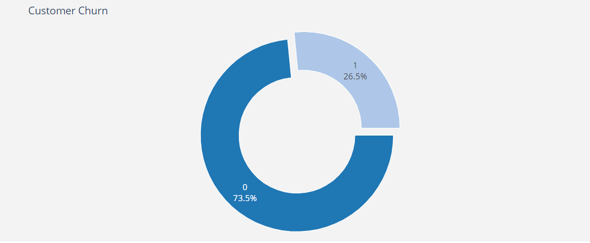
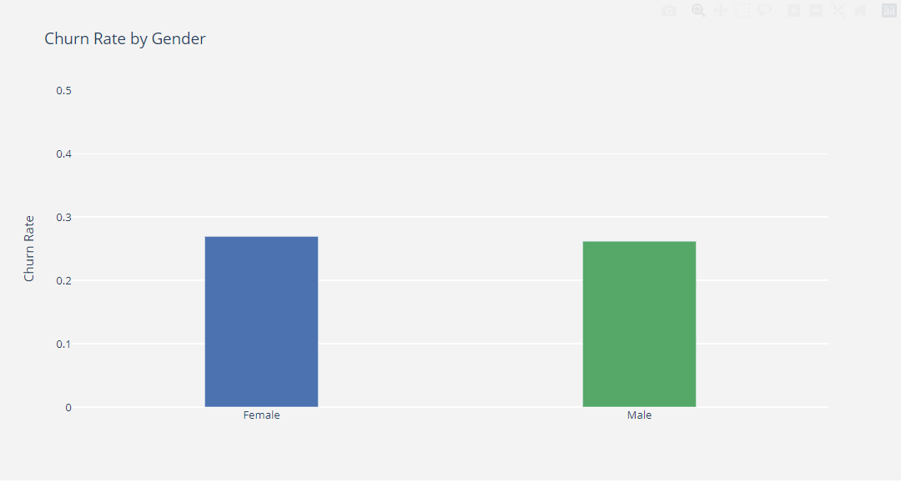
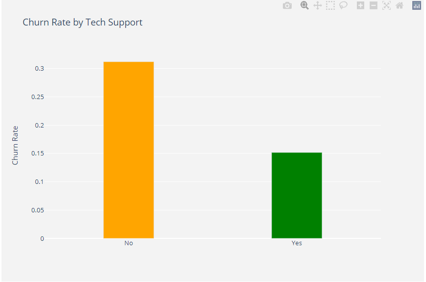
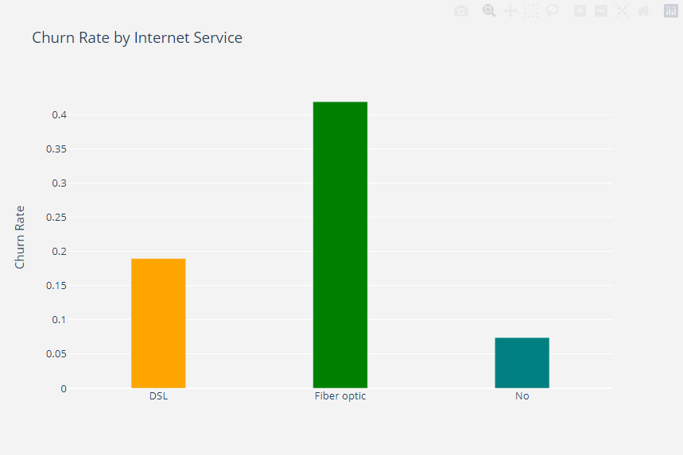
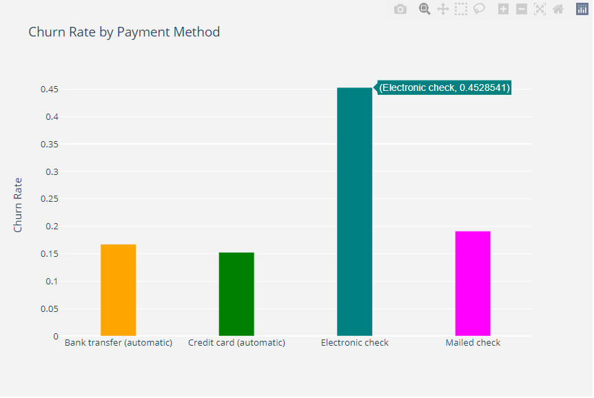
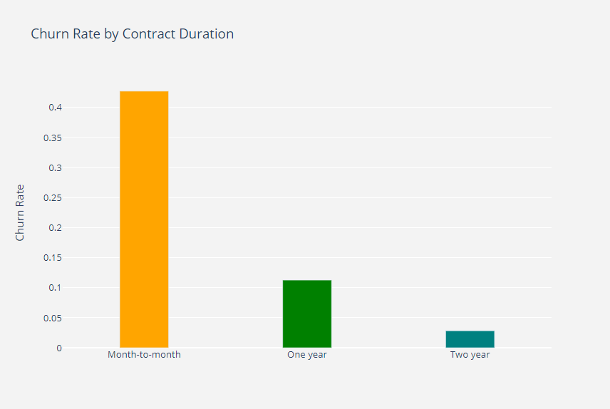
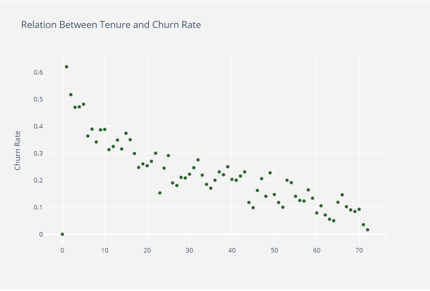

# Refining the Final Project Description

## Mission Statement

Our mission is to investigate and analyze customer churn in the telecommunications industry. We chose this topic because it is a common issue faced by telecom companies, and our analysis aims to provide insights that could help businesses reduce their churn rates and improve customer retention.

## Project Overview

The Telcom Customer Churn dataset includes information about customers of a telecom company, their demographics, the services they use, and whether or not they have churned (i.e., stopped using the company's services). The raw data consists of 7,043 rows (customers) and 21 columns (features).

## Research Questions

Our primary research question is: What factors are related to customer churn in the telecommunications industry, and how can these factors be utilized to predict which customers are likely to churn in the future? To answer this question, we plan to conduct exploratory data analysis to identify patterns and relationships in the data. We will then develop and evaluate predictive models using machine learning techniques.

Additional research questions include:

- What are the top three most popular services that customers prefer to use?
- How many customers who have unsubscribed still use the phone service?
- Based on the information given, what is the percentage of people who will retain?
- What is the best matrix method to use for this platform?
- Could a model built on this dataset be used to predict churn in the future?

## Customer Churn Analysis

### Project Status

This project has been completed and is no longer being updated.

### Visualizations

We have included several visualizations in our analysis to help illustrate our findings, including:

- Customer Churn Pie Chart

- Churn by Gender Bar Graph

- Churn Rate by Tech Support Bar Graph

- Churn by Internet Service Bar Graph

- Churn by Payment Method Bar Graph

- Churn by Contract Duration Bar Graph

- Relation between Tenure and Churn Rate Scatter Plot

### Project Description

Our analysis aimed to investigate customer churn in a telecom company. We analyzed the dataset to identify patterns and trends in customer behavior that could be utilized to prevent churn.

### Questions Addressed

In this project, we addressed the following questions:

- What is the overall churn rate in the dataset?
- How does churn rate vary by gender?
- How does churn rate vary by tech support usage?
- How does churn rate vary by internet service?
- How does churn rate vary by payment method?
- How does churn rate vary by contract duration?
- Is there a relationship between tenure and churn rate?

### Data Exploration

We explored the dataset using various visualizations, including pie charts, bar graphs, and scatter plots. We analyzed the distribution of the features and cleaned any missing data.

### Analysis

We trained and tested several machine learning models on the dataset, including logistic regression, support vector machines, k-nearest neighbors, decision trees, and random forests. We compared the models based on their accuracy, and the logistic regression model was selected as the best performer.

### Technologies Used

We used several technologies in our analysis, including Python, Jupyter Notebook, Scikit-learn, Pandas, NumPy, Matplotlib, Seaborn, one-hot encoding, feature scaling, logistic regression, support vector machines, k-nearest neighbors, decision trees, and random forests.

### Team Members

Our team consisted of Christian Perez, Marley Amisial, Kim Chung, and Issa Olmedo.

### Resources

We utilized the Telco Customer Churn dataset available on Kaggle (https://www.kaggle.com/datasets/blastchar/telco-customer-churn).
